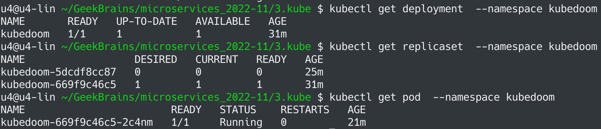
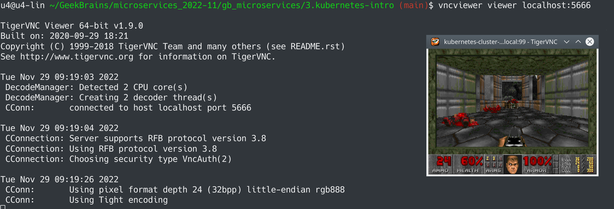

# Микросервисная архитектура и контейнеризация
## Урок 3. Введение в Kubernetes
### Задание
> https://github.com/adterskov/geekbrains-conteinerization/tree/master/homework/3.kubernetes-intro

### Решение
1. Создать Service account - применить манифест srvacc.yaml
2. Создать deployment - применить манифест kubedoom-d.yaml 

3. Пробросить порт командой `kubectl port-forward pod/kubedoom-669f9c46c5-2c4nm 5666:5900 --namespace kubedoom`
4. Подключить к VNC командой `vncviewer viewer localhost:5666`

