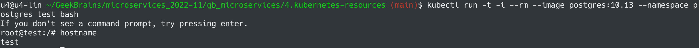
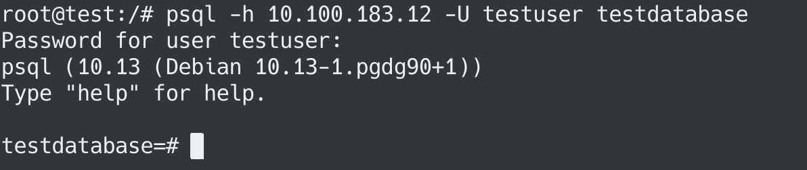
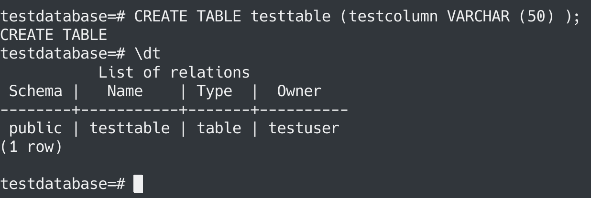
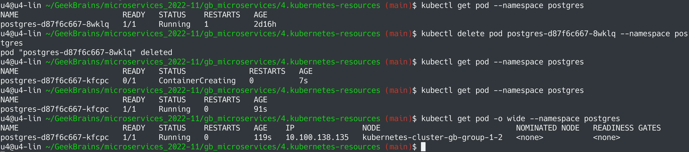
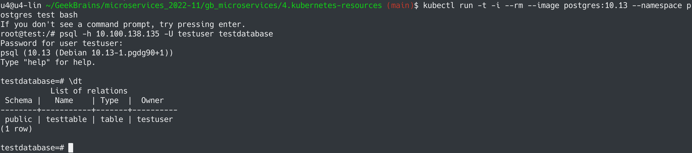

# Микросервисная архитектура и контейнеризация
## Урок 4. Хранение данных и ресурсы
### Задание
https://github.com/adterskov/geekbrains-conteinerization/tree/master/homework/4.resources-and-persistence
### Решение
1. Создать Namespace: `kubectl apply -f postgres-ns.yaml`
2. Создать Secret: `kubectl apply -f secret.yaml --namespace postgres`
3. Создать PVC: `kubectl create -f pvc.yaml --namespace postgres`
4. Создать deployment: `kubectl apply -f postgres-d.yaml --namespace postgres`

5. `kubectl get pod -o wide --namespace postgres`

6. `kubectl run -t -i --rm --image postgres:10.13 test bash`

7. `psql -h 10.100.183.12 -U testuser testdatabase`

8. `CREATE TABLE testtable (testcolumn VARCHAR (50) );`

9. Удаление и пересоздание pod-а

10. Проверка, что созданная ранее таблица никуда не делась
