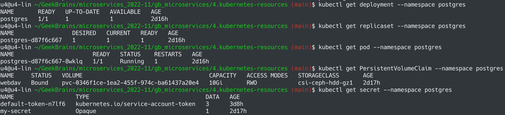
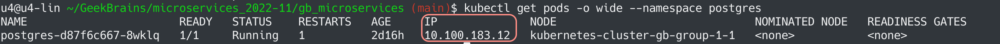

# Микросервисная архитектура и контейнеризация
## Урок 4. Хранение данных и ресурсы
### Задание
https://github.com/adterskov/geekbrains-conteinerization/tree/master/homework/4.resources-and-persistence
### Решение
1. Создать Namespace: `kubectl apply -f postgres-ns.yaml`
2. Создать Secret: `kubectl apply -f secret.yaml --namespace postgres`
3. Создать PVC: `kubectl create -f pvc.yaml --namespace postgres`
4. Создать deployment: `kubectl apply -f postgres-d.yaml --namespace postgres`

3. Пробросить порт командой `kubectl port-forward pod/kubedoom-669f9c46c5-2c4nm 5666:5900 --namespace kubedoom`
4. Подключить к VNC командой `vncviewer viewer localhost:5666`

