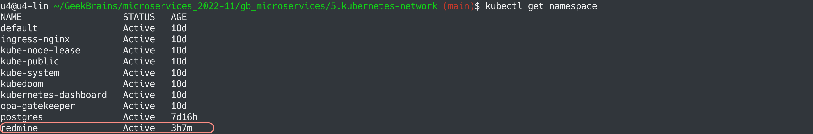
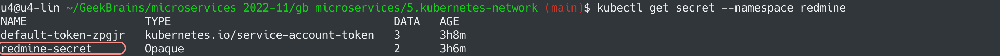
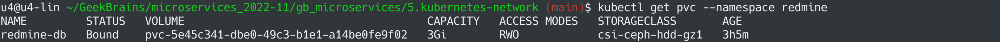
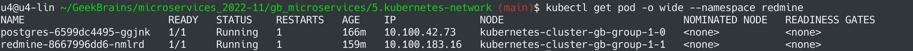
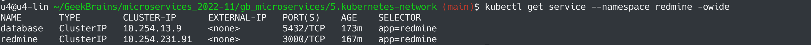
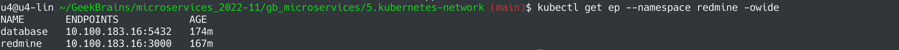
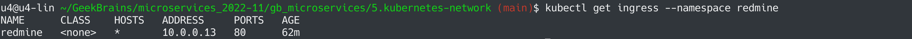
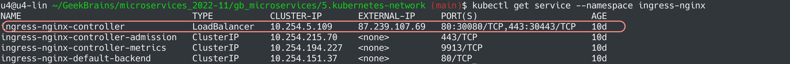

# Микросервисная архитектура и контейнеризация
## Урок 5. Сетевые абстракции Kubernetes
### Задание
https://github.com/adterskov/geekbrains-conteinerization/tree/master/homework/5.kubernetes-network
### Решение
1. Создать Namespace: `kubectl apply -f namespace-redmine.yaml`

2. Создать Secret: `kubectl apply -f secret-redmine.yaml --namespace redmine`

3. Создать PVC (для postgres): `kubectl create -f pvc.yaml --namespace redmine`

4. Создать deployment postgres: `kubectl apply -f deployment-postgres.yaml --namespace redmine`
5. Создать deployment redmine: `kubectl apply -f deployment-redmine.yaml --namespace redmine`

6. Создать сервис postgres: `kubectl apply -f service-postgres.yaml --namespace redmine`
7. Создать сервис redmine: `kubectl apply -f service-redmine.yaml --namespace redmine`

8. Создать Ingress: `kubectl apply -f ingress-redmine.yaml --namespace redmine`

9. Определеить внешний IP: `kubectl get service --namespace ingress-nginx`

10. Проверка: `curl -s -k 87.239.107.69 | grep "Powered by "`

