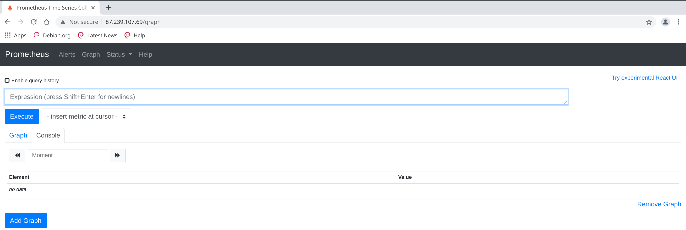
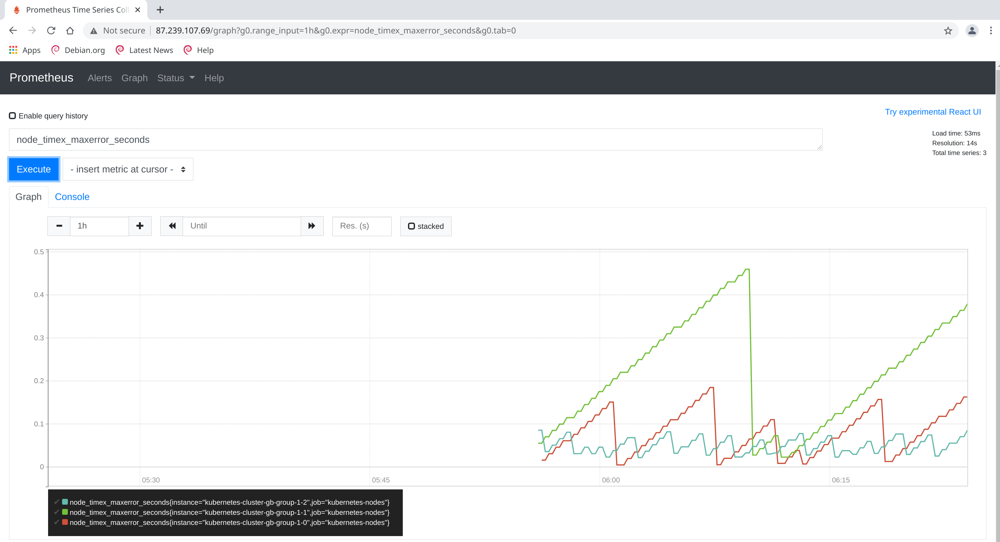

# Микросервисная архитектура и контейнеризация
## Урок 7. Продвинутые абстракции
### Задание
https://github.com/adterskov/geekbrains-conteinerization/tree/master/homework/7.advanced-abstractions
### Решение
1. Создать ConfigMap: `kubectl apply -f prometheus_configmap.yaml`

2. Создать ServiceAccount: `kubectl apply -f prometheus_serviceaccount.yaml`

3. Создать StatefulSet: `kubectl apply -f prometheus_statefulset.yml`

4. Создать Service: `kubectl apply -f prometheus_service.yaml`

5. Создать Ingress: `kubectl apply -f prometheus_ingress.yaml`

6. Проверка доступности Prometheus через браузер:

7. Создать DaemonSet: `kubectl apply -f daemonset-nodeexporter.yaml`

9. Status -> Targets

10. Запрос node_load1 не нашел, вместо этого выполнен node_timex_maxerror_seconds:

