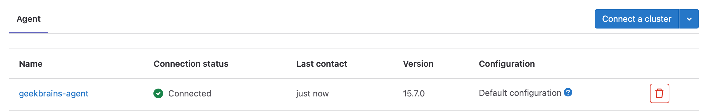
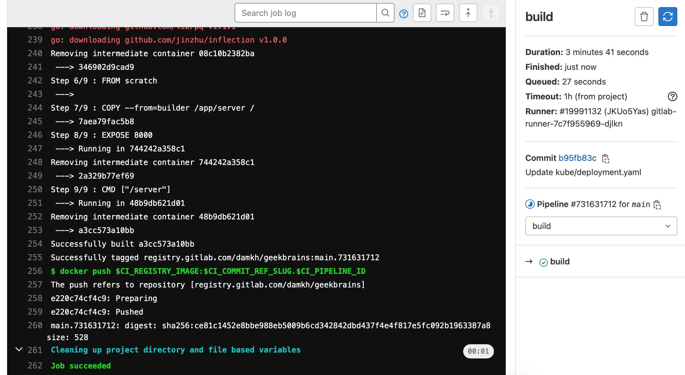
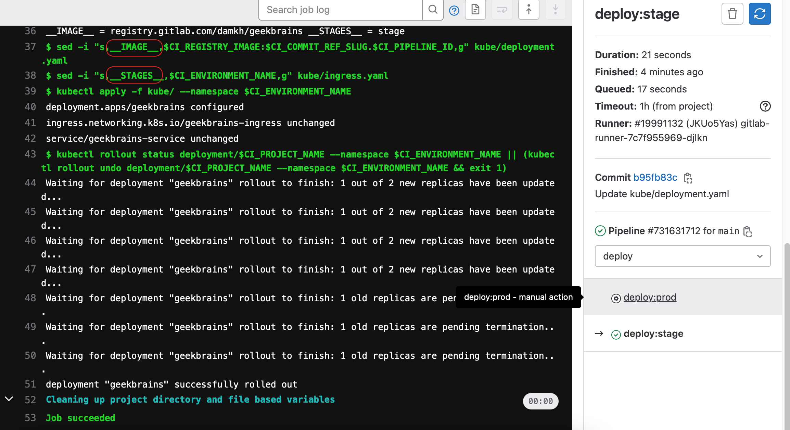
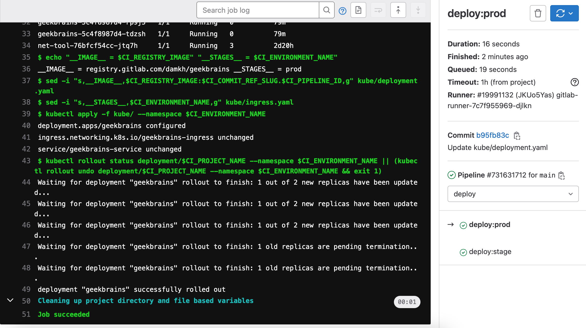
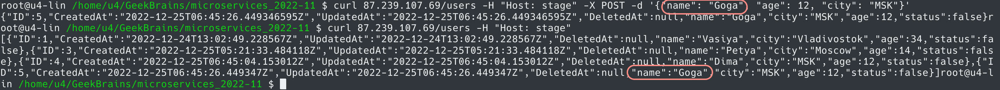
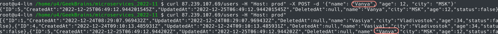

# Микросервисная архитектура и контейнеризация
## Урок 8. Деплой тестового приложения в кластер, CI/CD
### Задание
https://github.com/adterskov/geekbrains-conteinerization/tree/master/homework/8.ci-cd
### Решение
1. Повторить все шаги из урока 8. Все опубликовано в репозиторий https://gitlab.com/damkh/geekbrains.git  
При этом некоторые шаги урока были изменены:  
1.1 В уроке репозиторий инициализируется веткой main, но в .gitlab-ci.yaml в разделе deploy используется ветка master  
1.2 В gitlab-runner.yaml изменено следующее (без этого процессы в dind не запускались):  
```
securityContext:
  allowPrivilegeEscalation: true
  privileged: true
```
1.3 Связь с класером Kubernetes выполнена через установка агента по инструкции https://docs.gitlab.com/ee/user/clusters/agent/index.html, так как при деплое выдавалась ошибка о невозможности найти файл `/tmp/kubeconfig`.  

Однако строка `- export KUBECONFIG=/tmp/kubeconfig` видимо не влияет на ход развертывания. Если ее закомментировать, процесс проходит так же без ошибок.  

2. Заменить имя образа и имя стейджа на плейсхолдер. В файле `.gitlab-ci.yaml` вставлены строки:  
```
    - sed -i "s,__IMAGE__,$CI_REGISTRY_IMAGE:$CI_COMMIT_REF_SLUG.$CI_PIPELINE_ID,g" kube/deployment.yaml
    - sed -i "s,__STAGES__,$CI_ENVIRONMENT_NAME,g" kube/ingress.yaml
```

3. Сборка и деплой:  
Build:  

Деплой в stage:  

Деплой в prod:  

Работа приложения на stage:  

Работа приложения на prod:  


---
## Проблемы, возникшие в ходе выполнения домашней работы:
Проблема ContainersNotInitialized: "containers with incomplete status: [init-permissions]"  
https://gitlab.com/gitlab-org/gitlab-runner/-/issues/28747

Проблема Error: unknown command "sh" for "kubectl"  
https://gitlab.com/gitlab-org/gitlab-foss/-/issues/65110

Проблема "docker: Cannot connect to the Docker daemon at tcp://docker:2375. Is the docker daemon running?"  
https://gitlab.com/gitlab-org/gitlab-runner/-/issues/27215/?_gl=1*8534ci*_ga*MjA2NDQ4ODc5MS4xNjY0MzUwNDU4*_ga_ENFH3X7M5Y*MTY3MTYyOTEyOC4yMC4wLjE2NzE2MjkxMjguMC4wLjA.

Недостаточно прав для выполнения в dind:  
https://docs.gitlab.com/runner/executors/kubernetes.html#using-dockerdind

Подключения агента Gitlab <-> Kubernets  
https://docs.gitlab.com/ee/user/clusters/agent/index.html  
https://docs.gitlab.com/ee/user/infrastructure/clusters/migrate_to_gitlab_agent.html  
https://docs.gitlab.com/ee/user/clusters/agent/ci_cd_workflow.html#update-your-gitlab-ciyml-file-to-run-kubectl-commands  
